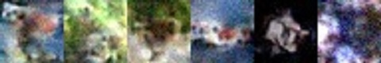

# pytorch - Denoising Diffusion Probabilistic Models 구현체

이 페이지에는 [Ho et al., 2020](https://arxiv.org/abs/2006.11239)의 논문의 `ddpm` 알고리즘을 제 이해를 목적으로 짠 pytorch 코드가 담겨 있습니다. [`main.py`](./main.py) 파일에서 32x32의 CIFAR10 데이터셋을 이용해 모델을 학습할 수 있습니다. 추후에 LSUN, CelebA와 같은 데이터셋을 이용해 학습을 시도할 예정입니다.
코드의 대부분은 [pytorch-diffusion](https://github.com/awjuliani/pytorch-diffusion)의 github를 참고 했습니다. 

## Requirements
* pytorch
* torchvision
* opencv-python

## 사용법
```bash
python main.py
```

## 결과


